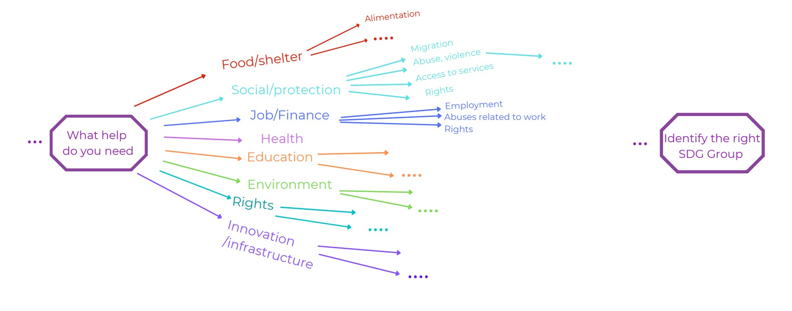

# Dots by ConnectingDots

Dots: the alternative legal aid tech.
A tool to connect people in need to the organisations best equipped to help them.

The project was developed for [Kona Connect](https://kona-connect.org/). Detailed information available under https://kona-connect.org/dots-legal-aid-tech/

##  Idea / Our Proposal 

- Offline application - once downloaded, no internet connection is required for the users to use it. Can be accessed anytime, anywhere.
- The users are guided through a set of personal identification and needs questions that enable the app to find the right organisation for them.

##  Technical Solution

- React Native Frontend application using Expo Framework, available for Android and IOS.
- No backend, all data required by the application is stored in json format under `./Frontend/assets/jsonFiles` for both content and configuration.
- Minimal running cost of the application considering no additional cost is required for storage or backend infrastructure.

##  How does it work

1. User needs to provide personal identification information (age, gender, etc.).
2. Identifying their needs, based on a hierarchy of questions derived from the SDG definition (Dots diagram) by grouping different subsections into similar areas.
   <p align="center">
     
   </p>
   Configuration of the needs hierarchy options and the mapping to SDG Group ID is stored inside the application in .json format. This data is used in the application to dynamically generate the Needs Questionnaire with the different options and derive the underlying SDG Group ID that would be used to filter the Organisation data:
   - "options_map" for Individual selection
   - "companies_options_map" for Company/Organisation selection

3. Showing the list of relevant organisations for the user based on their selections.
   The system will filter the organisation data based on:

   - Personal identification information - for example if the user selects age: 0-12 -> filter only for organisations relevant for children
   - SDG Group derived based on the needs questionnaire

4. Display detailed information about the organisations. Relevant details of the organisation selected by the user will be shown on the screen (Organisations in Senegal).

# Installation

##  Prerequisites

- [Node.js](https://nodejs.org/en/download/)
- [Expo CLI](https://docs.expo.dev/get-started/installation/)

##  Developers / Testers

For developers/testers that want to be able to run the code locally and develop or test:

- [Android simulator](https://developer.android.com/studio) - Androit's phone emulator. Installation steps for both Windows and Mac can be found [here](https://developer.android.com/studio/install)
- [iOS simulator](https://developer.apple.com/xcode/) - Apple's simulator.
- [Expo app](https://play.google.com/store/apps/details?id=host.exp.exponent&hl=en&gl=US) - developer tool to be able to run/test the app on mobile

## Getting started

1. Clone [deploy-impact-21-kona-c repo](https://github.com/WomenPlusPlus/deploy-impact-21-kona-c) locally
2. Go to Frontend folder and run:

```bash
cd deploy_impact_21_kona_c/.Frontend
npm install
npm start
```

3. Metro Bundler should open on localhost
4. You can now run your application in 2 ways
   1. On a local computer using a phone emulator launching the virtual device configured (Android or IOS)
   2. Open the Expo app on the phone and scan the QR code from the Metro Bundler page

---

# Testing

## Unit Tests

Unit tests are available under ./Frontend/test folder. They can be run via the following command.

```bash
npm run test
```

Results will look like this

<p align="center">
     
   </p>

## Manual Tests

Manual tests cases that were created and executed are available [here](./docs/TestCases.xlsx). It contain an initial set of test cases that can be further expanded.

---

# Data

All data required by the application is currently stored inside the application in the `./Frontend/assets/jsonFiles` folder. This includes organisations data as well as data used for the hierarchy mapping of the needs, questionnaire options and mapping to SDG Group. The application uses this hierarchy mapping to dynamically generate the different options for the users depending on their selection.

All .json files used by the application were generated based on a original .csv files that can be found here: `./Frontend/assets/csvFiles`. Users can easily maintain the .csv files and, when ready, the files can be easily converted to .json format and the application will use the new data.

<p align="center">
  
</p>

Based on the current implementation an update of the organisation or configuration data would require an update of the application as the data is self contained in the app. In the future, this can be enhanced by having the data in a central location and the application will update the data content at specific intervals when connected to the internet.

## Update of Organisations data

In order to update some of the organisation details, the organisations.json file needs to be modified with the new information. This can be done by:

- Update the organisation.csv file. The structure of the file should be the same as the old version, just an update of the data content.
- Generate a new json file based on the updated .csv file. This can be easily done by using the steps defined under [Conversion to json file](#conversion-to-json-file) section.

There is always the option to manually update the underlying organisation.json file, but we would recommend updating the organisation.csv file first and generating the json file from it. This is so that the golden source of the data remains in a redeable format on the .csv file.

After this, the application will use the new data for the organisations. Remember to test the changes before you go ahead with the update.

## Needs Options and Mapping to SDG - maintenance

The application generates dynamically the options for the needs questionnaire as well as the mapping of the different options to the SGD Group based on configuration data in the application. This mapping is stored in the application under `./assets/jsonFiles`.

- options_map.json - stores the 3 level hierarchy of the needs options together with the mapping for SDG Group ID for Individuals
- companies_options_map.json - stores the needs options for the Company/Organisation

This data can be updated in the same way as the organisation data by updating the right file depending on whether there are changes required for the needs questionnaire for Individuals, Company or both:

- Update the required .csv file(s). The structure of the file should be the same as the old version, just an update of the data content.
- Generate new json file(s) based on the updated .csv files. This can be easily done by using the steps defined under [Conversion to json file](#conversion-to-json-file) section.

After this, the application will use the new configuration data to generate the needs questionnaire. Remember to test the changes before you go ahead with the update.

## Conversion to json file

Required to update: organisations, options_map and companies_options_map data files.

To generate a json file from a csv file:

1. Update any of the csv files in `./Fontend/assets/csvFiles`
2. Make sure the structure of the file is the same as the previous file
3. Generate the json file

```bash
cd deploy_impact_21_kona_c/.Frontend
npm run convert-csv
```

4. `./Fontend/assets/jsonFiles` should be already updated.

---

# Future Developments

---

# FAQ and Troubleshooting

> 1. Why do I have a folder named ".expo" in my project?

The ".expo" folder is created when an Expo project is started using the "expo start" command.

> 2. What does the "packager-info.json" file contain?

The "packager-info.json" file contains port numbers and process PIDs that are used to serve the application to the mobile device/simulator.

> 3. What does the "settings.json" file contain?

The "settings.json" file contains the server configuration that is used to serve the application manifest.

> 4. Should I commit the ".expo" folder?

No, you should not share the ".expo" folder. It does not contain any information that is relevant for other developers working on the project, it is specific to your machine.

Upon project creation, the ".expo" folder is already added to your ".gitignore" file.

---

## Team Members

- [@bebolor](https://github.com/Bebolor) - Frontend, UI/UX design
- [@veloqueen](https://github.com/veloqueen) - Frontend
- [@natayra](https://github.com/natayra) - Frontend lead
- [@ClaudiaNicolae](https://github.com/ClaudiaNicolae) - Project manager, Scrum master 
- [@Karen](https://www.linkedin.com/in/karen-bhavnani-b889a89/) - Project manager

---

## License: GPL-3.0 License

---

Project developed during [Women ++](https://www.womenplusplus.ch/) 's deploy(impact)'s program between 16th October - 27th November 2021
[deploy impact](https://www.womenplusplus.ch/deploy-impact) is a hands-on software development program for social good.
